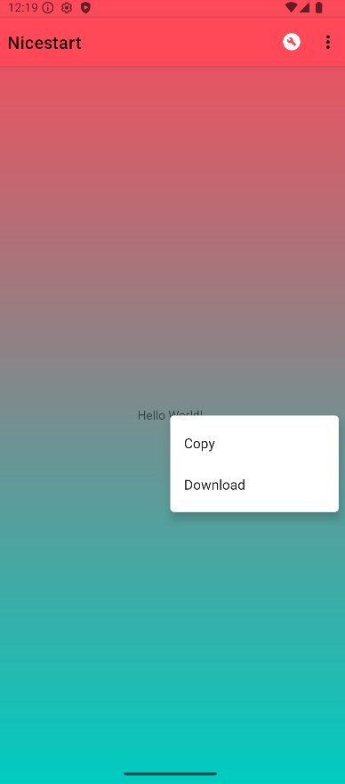
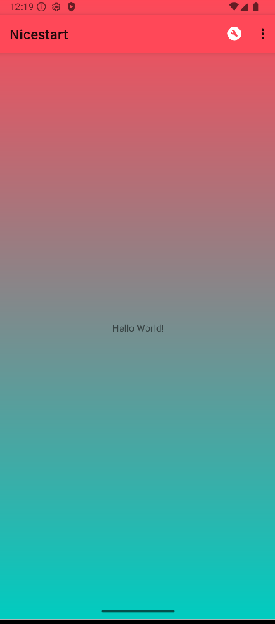

# NiceStart

Bienvenido al repositorio **NiceStart**, un proyecto en **Java** diseñado para ofrecer una base sólida para aplicaciones con pantallas de inicio y registro.  
El objetivo de este proyecto es servir como punto de partida (“nice start”) para desarrollos que requieran autenticación, interfaz amigable y estructura limpia.

---

## Imagenes
**imagen del login.**

---
**imagen del registro.**

---

## Contribuir

Las contribuciones son **bienvenidas**.  
Para colaborar:

1. Haz un *fork* del repositorio.
2. Crea una nueva rama:
   ```bash
   git checkout -b feature/tu-idea
   ```
3. Realiza tus cambios y haz *commit*.
4. Envía un *pull request* explicando tus mejoras.

> Asegúrate de que el código compile correctamente y mantenga el estilo del proyecto.

---

## Licencia

Este proyecto está licenciado bajo **Creative Commons BY-NC-SA 4.0**.  
https://creativecommons.org/licenses/by-nc-sa/4.0/

---

## Estado del proyecto

 **En desarrollo**  
Actualmente incluye las funcionalidades básicas de inicio de sesión y registro.

Futuras mejoras planificadas:
- Validación avanzada de usuarios.
- Integración con bases de datos.
- Interfaz gráfica mejorada.
- Soporte multilenguaje.

---

** Gracias por usar NiceStart. ¡Tu próximo proyecto puede empezar aquí!** 🚀

**Actualizaciones**
- He creado un meno al mantener pulsado la palabra del main como en la imagen 
- Ademas tambien he una animacion en el logo al entrar en la app creando un pantalla llamada splash 
- He añadido en el main en la appbar un menu iacon y un icono 

## Imagenes
---
**imagen del logo**

---
**imagen del menu**

---
**imagen del appbar**

---
